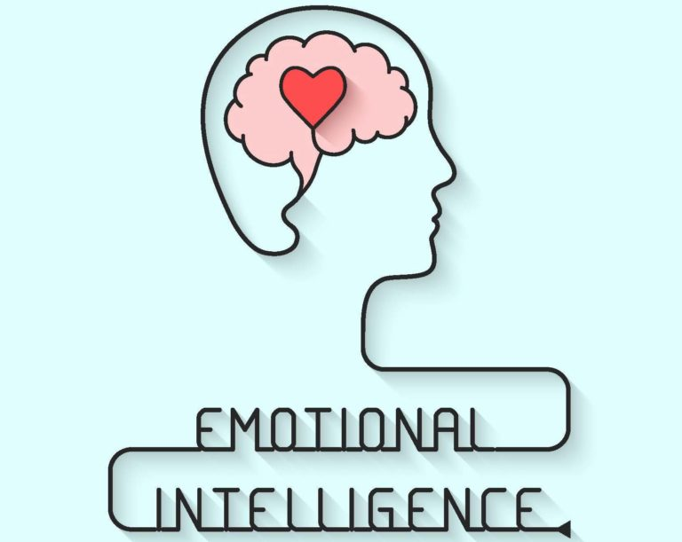
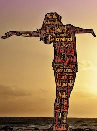
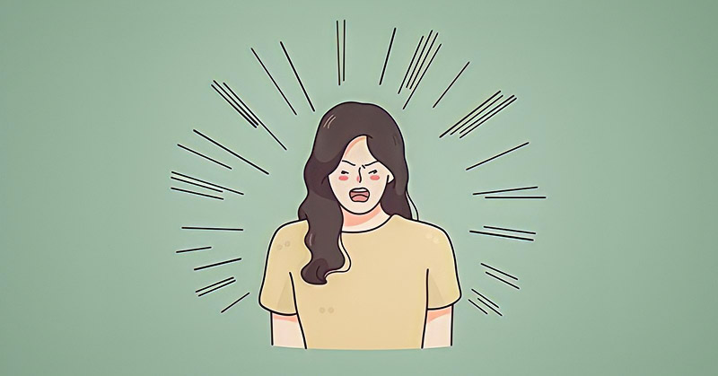

*Reference is Page 11 of Emotional Intelligence topic under professional skills* 

Use case group discussion:In small groups, discuss the following questions, and write down your group’s answers.

1. *What is a positive attitude?
*
A **positive attitude** is an optimistic, forward-looking mindset where a person chooses to focus on possibilities, solutions, and the good in situations. It involves a general sense of hopefulness, enthusiasm, and confidence, even when faced with challenges or setbacks. People with a positive attitude tend to see opportunities where others might see problems.

2. *If someone has a positive attitude, what types of actions would you observe?*
- **Encouragement and support:** They often motivate others and offer help or praise when needed.
- **Perseverance:** They keep trying despite difficulties, maintaining optimism about the outcome.
- **Problem-solving:** They look for solutions instead of dwelling on problems.
- Gratitude: They express thankfulness and appreciation for small and big things.
- **Smiling and cheerful behavior:** They often have an open and friendly demeanor, with actions that show kindness and patience.

3. *How would other people regard someone with a positive attitude?*
- **Admiration and respect:** People are likely to admire their ability to stay optimistic, even in tough situations.
- **Likability:** They are usually well-liked because they make others feel good and create a positive environment.
- **Trustworthiness:** They might be trusted more because they seem to handle situations in a balanced, thoughtful way.
- **Inspiration:** Their behavior can inspire others to adopt a similar outlook or work harder.

4. *What is a negative attitude?*

A **negative attitude** is a pessimistic, critical mindset where a person tends to focus on the negative aspects of situations. They might expect bad outcomes or view challenges as overwhelming or impossible to overcome. It often involves a sense of discouragement, frustration, or anger.

5. *If someone has a negative attitude, what types of actions would you observe?*
Complaining and criticizing: They may frequently complain about situations or criticize others.
- **Blaming others:** They may refuse to take responsibility and blame others for problems or challenges.
- **Avoidance of tasks:** They might avoid doing tasks because they assume failure or feel it's not worth trying.
- **Lack of cooperation:** They may be unhelpful in group settings and reluctant to support others.
- **Showing frustration or anger:** They might show their negative feelings openly, with impatience, irritation, or withdrawal.

6. *How would other people regard someone with a negative attitude?*

- **Avoidance:** Others might avoid interacting with them because they bring negativity into conversations or situations.
- **Frustration:** People may feel frustrated with their lack of enthusiasm or their resistance to positive efforts.
- **Disrespect or disregard:** They might be viewed as unhelpful or uncooperative, leading others to respect their opinions less.
- **Pity:** In some cases, others might feel sorry for them, understanding their negative attitude as a sign of deeper unhappiness or struggles.