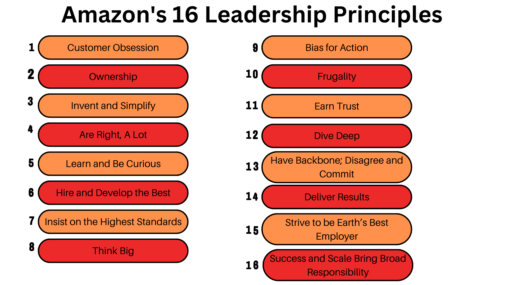

*REFERENCE FOR TASK: page 7 of 'Activity Introduction to the Amazon Leadership Principles' topic under professional skills*

# Leadership Principles:

==**Questions**==
1. Which leadership principles do you think are similar? 
- Customer Obsession & Insist on the Highest Standards
- Deliver Results & Customer Obsession
- Learn and be curious  & Dive Deep
- Hire and Develop the Best & Insist on the Highest Standards

2. Which leadership principles do you think are opposites?
- Invent and simplify & Think Big

3. Which leadership principles do you consider your strengths?
- Earn trust
- Have Backbone; disagree and connect
- Learn and be curious
- Ownership

4. Which leadership principles can you develop?
- Success and scale bring broad responsibility
- Deliver results
- Are right, a lot

🅰️👥👥👥 **Group member names**🅰️👥👥👥
1. Tracy Opoku Afriyie
2. Rocio Perez Lopez
3. Zakariya Wiseman
4. Jude Alabi
5. Maureen Fischer-Wilmot
6. Iyabolatunji
