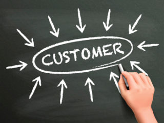

*REFERENCE FOR TASK: page 4 of 'leadership principles customer obsession' topic under professional skills*

### Think of a time when you demonstrated this leadership principle, and use the STAR methodology to document your story.

**Situation:**  As a Technical Operator at FOX News, I was responsible for ensuring that subject matter experts joined the FOX Breakfast Programme seamlessly. One morning, we had a guest who was completely new to our broadcasting setup and was struggling to connect remotely.

**Task:** My goal was to ensure the guest appeared on the show on time without any technical hiccups. Given their inexperience with basic technology, this was a challenging task, especially considering the live nature of the program.

**Action:** I quickly realized that the guest needed more than standard assistance. I took the initiative to provide personalized guidance, breaking down the technical process into simple, easy-to-follow steps. I used screen-sharing to visually demonstrate each step, and I stayed on the line with them until they were completely comfortable. I even tested their setup multiple times to ensure everything was ready to go.

**Result:** Thanks to my efforts, the guest successfully joined the program on time and their segment went off without a hitch. The guest expressed their appreciation for my patience and clear instructions, and my team also commended me for my problem-solving skills and dedication to ensuring a smooth broadcast. This experience reinforced my ability to adapt to challenging situations and provide exceptional support to our guests.

