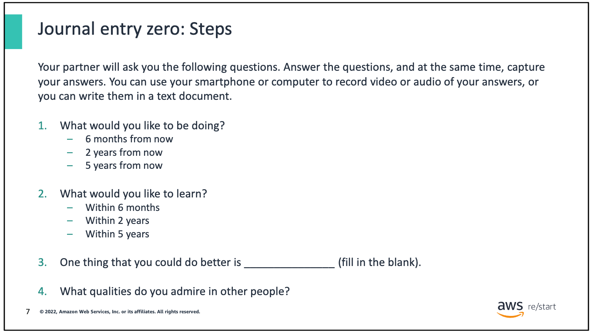

# WHO_AM_I TASK

### 1.What would you like to be doing?

### 6 Months from now?🤔

1. ==**First Tech Job:**==

- ⚽⚽⚽ **Goal:** Secure my first job in the tech industry.
- 🎬🎬🎬 **Action Steps:** Focus on applying to entry-level positions, tailoring my resume to highlight relevant skills, and preparing for technical interviews. Consider building a portfolio of projects to demonstrate my practical knowledge. Networking through tech communities, LinkedIn, or meetups could also be beneficial.
- 🏅🏅🏅**Expected Outcome:** I should aim to land a role that aligns with MY interests and provides a strong foundation for growth, such as a junior developer, IT support, or cloud practitioner role.

2. ==**AWS Courses and Certifications:**==

- ⚽⚽⚽ **Goal:** Complete AWS (Amazon Web Services) courses and obtain certifications.
- 🎬🎬🎬 **Action Steps:** Choose a reputable course that matches my skill level, such as AWS Certified Cloud Practitioner  or AWS Certified Solutions Architect. Dedicate regular study time, utilize practice exams, and engage with online communities for support.
- 🏅🏅🏅**Expected Outcome:** Achieving AWS certification will not only boost my resume but also give me practical skills in cloud computing, which is highly valued in the tech industry.

### **B.  2 Years from Now?** 👏🏾

1. ==**Higher Pay:**==

- ⚽⚽⚽ **Goal:** Move into a position with higher compensation, reflecting my increased experience and skills.
- 🎬🎬🎬 **Action Steps:** After gaining 1-2 years of experience in my current role, begin exploring opportunities for advancement. This might include taking on more responsibilities at my current job, seeking promotions, or looking for higher-paying positions elsewhere. Continue to upskill, possibly by earning additional certifications (like AWS Solutions Architect – Professional or DevOps Engineer), learning new technologies, or specializing in a particular area of tech.
- 🏅🏅🏅**Expected Outcome:** Within two years, I should be in a position to command a higher salary, whether through a new role or a promotion, reflecting my growing expertise and industry value.

### **C. 5 Years from Now?** 🤸🏽‍♂️

3. ==**Higher Pay:**==

- ⚽⚽⚽ **Goal:** Continue to advance in my career with a focus on significantly higher compensation, potentially reaching a senior or specialized role as well as learning to code.
- 🎬🎬🎬 **Action Steps:** Over the next few years, work on deepening my expertise and possibly transitioning into more strategic or leadership roles. This could involve becoming a senior developer, cloud architect, or moving into management. Consider pursuing advanced certifications, a master's degree, or other professional development opportunities that align with my career path. Networking and mentorship can also play a crucial role in identifying and seizing opportunities for growth.
- 🏅🏅🏅**Expected Outcome:** By the 5-year mark, I should be in a position with substantial responsibility, possibly overseeing teams or projects, with a corresponding increase in salary. My experience and skills should place me in a competitive position in the job market, with opportunities for continued advancement and specialization.

*This plan provides a clear pathway to achieving your career goals, with a focus on continuous learning, skill development, and strategic career moves.*

### 2.One thing that you could do better is _______________(fill in the blank)  

### ==*Managing my time*==  

Efficient time management is critical for me because it directly impacts my productivity, stress levels, and overall success. When I manage my time well, I can achieve more in less time, which allows me to be more productive and accomplish my goals. It also helps me maintain a better work-life balance, ensuring that I have time for both my professional and personal life. By staying organized, I can avoid the last-minute rush that often leads to mistakes, making my work more efficient and less stressful.

### **3. What qualities do you admire in other people?**

###  ==**'Resilience.'**==

Resilience is a quality I deeply admire in others. It’s the ability to bounce back from setbacks, challenges, and adversities with strength and determination. Resilient people face difficulties head-on, refusing to be defeated by obstacles. They have an inner strength that allows them to navigate through tough times, adapt to change, and keep moving forward, even when the odds are against them.

==**Teacher notes / comments-**== I suppose to show how to add link to md on vs code.

###### NB: Markdown ia a light weight markup language that is used for formatting elements to plaintext documents

[Markdown](https://www.markdownguide.org/cheat-sheet/)
